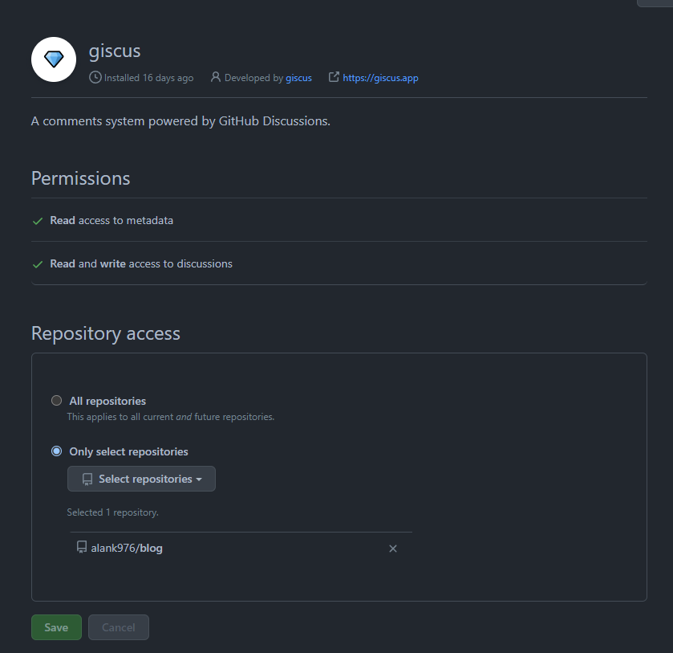

# Setting up a personal blog with Github Pages, Hugo and PaperMod

I decided to write blog posts to log my learning experiences as a tool of reflection. Apparently, opensource stuff is preferred since I don't want to pay for it.

## Github Pages

I heard about [Github Pages](https://pages.github.com/) can host static websites easily via converting some markdown into HTMLs. And actually, I had given it a shot long long time ago for my [resume](https://alank976.github.io/markdown-resume) with Jekyll. The experience is not bad, just that I had to tweak some HTML/CSS templates from time to time when I need to customize stuff. Not much to complain about given it's free. And again, it's powered by Github. It's techy :nerd_face:, and so it's sexy :joy:

## Hugo

Perhaps, a part of me believed some better alternatives must have emerged for this 3-year period. I decided to achieve the same thing differently this time and Hugo was picked. As I write Helm templates day to day, knowing Hugo is also from Go template is definitely another reason that pushed me towards it.

To start with, googling for a tutorial article is probably the most common way to do :wink: During following the [Quick Start](https://gohugo.io/getting-started/quick-start/) and [Host on GitHub](https://gohugo.io/hosting-and-deployment/hosting-on-github/) tutorials, I learnt three things noteworthy:

- Hugo allows "importing" the theme and style stuff by adding a git submodule, which results in a dynamic link to the theme repository without any pain
- The Hugo community is awesome. There are heaps of marketplaces/catalogs you can shop around for your favourite themes. For instance, https://themes.gohugo.io is a free one and the theme PaperMod I am using here is picked from there.
- The `hugo` CLI is great too. It supports "hot reload" and so it makes previewing how my content will be rendered way easier

I would skip the details about how I configured the properties in `config.toml` since it's tied to the chosen theme. All I need to do is to refer to the documentation PaperMod provides in [its Github Wiki](https://github.com/adityatelange/hugo-PaperMod/wiki).

## Github Action

It's basically a free CI tool I use in many other places as well. It contributes values too in even this simple blog post website since hugo needs to convert the markdown files into static resources like HTML/CSS, the so-called "build" step. All steps can be found in the tutorial above literally.

## giscus

Up to here, I checked out the theme submodule, did some configuration crunching, and set up the Github Actions workflow to build the HTMLs to `gh-pages` branch. After a few minutes, the blog should be reachable in [my github page URL](https://blog.alankan.dev). Are we done?

Not quite. As I mentioned in the welcoming page, comments are welcomed. How can I make this static page interactive instead of monotonically saying things in single direction? Again, I googled around and found these possibilities from this [stackoverflow answer](https://stackoverflow.com/a/61740829):

- Disqus :x: :money_with_wings:
- Facebook: Personal bias. Not a fan of facebook anymore...
- [utterances](https://utteranc.es/)
- and a few others

Utterances sounds a good fit since it simply uses Github issue as a data store of the comments, so it is free. Also, thanks to this high degree of reuse, I don't have to take care of authentication and data storage at all. And Utterances provides the layout and supports markdown, emojis, etc, all out of the box. The only requirements are: 
1. Making the repo public to allow people create github issues in your repo
2. Authorizing Utterances github app to integrate. You can authorize just a list of repos but not all of yours

But wait, issue? Are those really issues? I recalled Github released a lot of great new features in recent years. I mentioned _Actions_ and _Pages_. There are also _Registry_, and **Discussions**! **Discussions** fits **comment** semantics perfectly.

So, I did the second round of researching and finally found my solution - [giscus](https://giscus.app/) and a tutorial [here](https://www.cesarsotovalero.net/blog/replace-disqus-with-a-better-alternative.html). It shares the same mechanism and concepts as Utterances basically. Same goes for the requirements: public repo, integrate the app but one extra thing is enabling Github Discussions in repo settings as it is still a feature requiring an explicit opt-in somehow.
    
The way to include that part of the additional script is again specific to the chosen Hugo template. For PaperMod, it's as easy as enabling a config and including the `<script>` block accordingly as instructed.

That's it :tada:! That's how I create this blog that you are reading 😄. My 1st blog :white_check_mark:
